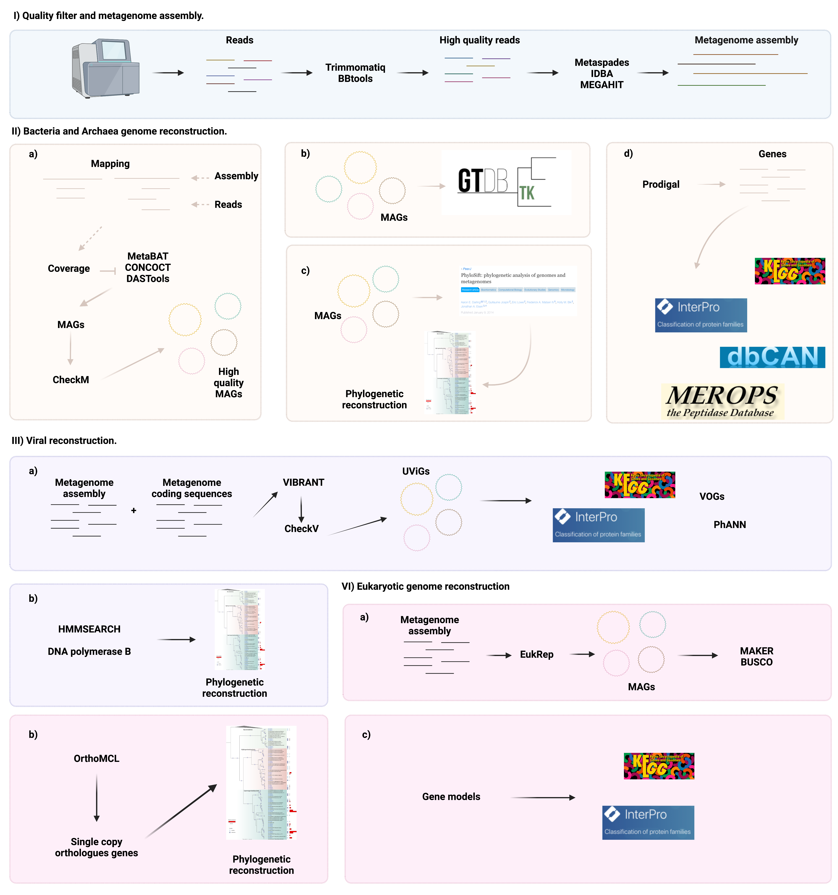

```{r, include = FALSE}
library(knitr)
library(tidyverse)
library(icons)
#library(emo)
library(xaringanExtra)
library(RefManageR)
# set default options
opts_chunk$set(echo=FALSE,
               collapse = TRUE,
               dpi = 300)

xaringanExtra::use_tile_view()
xaringanExtra::use_clipboard()
xaringanExtra::use_share_again()
xaringanExtra::style_share_again(
  share_buttons = c("twitter", "linkedin", "pocket")
)
```
class: right, middle, inverse, titular

# `r rmarkdown::metadata$title` 
### **`r rmarkdown::metadata$author`**
### `r rmarkdown::metadata$date`

---

# Mobile genetic elements (MGEs) in gut metagenomes

In the beginning, the mobile genetic elements were associated with pathogenic strains; however, this has changed with time [Dobrindt et al.2004](https://pubmed.ncbi.nlm.nih.gov/15100694/). For example, an immense diversity of phages has been described in the ocean, suggesting that these mobile elements might play a relevant role in microbial communities, working as seed banks for adaptive genes, which any community member can potentially acquire ([Fancello et al.2011](https://pubmed.ncbi.nlm.nih.gov/21816767/); [Modi et al.2013](https://pubmed.ncbi.nlm.nih.gov/23748443/); [Subirats et al.2016](https://pubmed.ncbi.nlm.nih.gov/27312355/)).

I started my search by looking for these three types of mobile elements.

- Insertion sequences
- Integrons
- Phages

---

# Insertion sequence elements in the gut metagenome

- To search for insertion elements I used [ISEScan](https://github.com/xiezhq/ISEScan). This program is a python pipeline that identifies elements requiring a nucleotide sequence as input and identifies both **complete** and **partial** IS (Insertion Sequence).

---
# Install **ISEScan**

- Create a conda environment

```{bash, eval=FALSE, echo=TRUE}
conda create -n isescan_env
```

- Activate the conda environment

```{bash, eval=FALSE, echo=TRUE}
conda activate isescan_env
```

- Add Bioconda channels

```{bash, eval=FALSE, echo=TRUE}
conda config --add channels defaults
conda config --add channels bioconda
conda config --add channels conda-forge
```

- Conda install

```{bash, eval=FALSE, echo=TRUE}
conda install  -n isescan_env -c conda isescan
```

---

# Run **ISEScan**


```{bash, eval=FALSE, echo=TRUE}
nohup isescan.py --seqfile 0118A1023.contigs.fa --output isescan_gut_microbiota --nthread 20 &
```


---

# Exploring the output of **ISEScan**

- The program uses [FragGeneScan](https://pubmed.ncbi.nlm.nih.gov/20805240/) to make the protein prediction, so one first exciting thing to look at is **how many proteins were inferred?** 

```{bash echo=TRUE, eval=F}
grep -c ">" 0118A1023.contigs.fa.faa
```

Number of sequences: 15,164

- **How many elements were inferred?** One first easy way to do it is to count the number of rows in the output file.

```{bash echo=TRUE, eval=F}
 wc -l 0118A1023.contigs.fa.tsv
```

Number of elements: 71
---
# Explore the output of **ISEScan**

- We can take a quick look to the output file.

```{r include=FALSE}
Insertion<-read_delim("../data/0118A1023.contigs.fa.tsv", 
           delim = "\t") # Reading the output file of ISEScan using tabular format.
```

```{r echo=F,  eval=T}
Insertion %>%
  DT::datatable(class = "compact", rownames = FALSE,
                options = list(dom = 'tBp', pageLength = 8, scrollX = TRUE), editable = 'cell',
                width = '90%')
```

---
# Explore the output of **ISEScan**

.right-column[

- Which families are more abundant?

```{r, echo=T, fig.height=5}
more_abundant<-Insertion %>%
  count(family) %>% # Count the number of elements in the family column
  arrange(-n) # Arrange the number from the from largest to smallest
head(more_abundant) # Show the top six
```

]

.left-column[

The most abundant element is:

- [IS21](https://tnpedia.fcav.unesp.br/index.php/IS_Families/IS21_family) 

]

---

# Complete and partial elements

Some of the IS elements can be **incomplete**, which may reflect ancestral transposition events, ([Siguier et al., 2014](https://academic.oup.com/femsre/article/38/5/865/496682)) suggesting that the rest of the key sequence features were lost over time.

Therefore, I focused at first on the complete elements, considering they might be more **recent** and **active** in the community. 

---
# Explore the output **ISEScan** 

**ISEScan** has an extra column indicating if the element is **complete** or **partial**; therefore, I filter the output file to find the most abundant complete elements in the metagenome.  
.right-column[

- Which ISs are complete?

```{r, echo=T}
Insertion %>%
  filter(type == "c") %>% # Filter the rows that had a "c" in the type column, that stands for complete
  count(family) %>%
  arrange(-n)
```

]

.left-column[

The most abundant elements that are also **complete** and probably more recent are: 

- [IS1182](https://tnpedia.fcav.unesp.br/index.php/IS_Families/IS5_and_related_IS1182_families)
- [IS3](https://tnpedia.fcav.unesp.br/index.php/IS_Families/IS3_family)

]

---
# **New hypothesis**

- What if there are **partial** sequences that also contain transposases? 
 
- Maybe the rest of the sequence is highly divergent, and that is why we can not find it matched to the databases; therefore, the sequences are not classified as complete?

- If they have transposases, that might mean that they must be elements that could be actively moving something in the community, but they are divergent and new, and the program can not classify them.

---

# Exploring the output of **ISEScan** to look for potential new elements.

- I run InterproScan to identify transposases domains in the sequences that were predicted with  [FragGeneScan](https://pubmed.ncbi.nlm.nih.gov/20805240/) by **ISEScan**.

```{bash echo=TRUE, eval=F}
interproscan.sh -cpu 20 -goterms -pa -i  0118A1023.contigs.fa.orf_interpr.faa > Log_Interpro_Scan_$i.txt
```

- Then I extracted a list of the IDs of the **partial** sequences.

```{r echo=TRUE}
list_partial<-Insertion %>%
  filter(type == "p") %>% # Here I am filtering the output table to extract the "partial" hits.
  select(seqID, orfBegin, orfEnd, strand) %>% # Select certain columns on the table
  unite("seq_name", c("seqID", "orfBegin", "orfEnd", "strand"), sep="_") %>% # The output of ISEScan uses as sequence ID the name of the scaffold so I create a new colum merging the information from the start and end of the sequence to be able to match the results with InterproScan
  distinct() %>% # Remove duplicated
  pull() # Create a vector
```

---

# Exploring the output of **ISEScan** to look for potential new elements.

- I read the output and filter the sequences based on the list.

```{r echo=TRUE, message=FALSE, warning=FALSE}
interpro<-read_delim("../data/0118A1023.contigs.fa.orf_interpro.faa.tsv", delim="\t", col_names = F) %>%
  filter(X1 %in% list_partial) %>% # Filter the table using the IDs extracted previously
  filter(X4 == "Pfam") %>% # Filter the output to get the PFAM domains
  select(X1, X5, X6) %>%
  filter(str_detect(X6, "Transposase")) # Search for elements annotated as transposases
```

```{r  echo=F,  eval=T}
interpro %>%
  DT::datatable(class = "compact", rownames = FALSE,
                options = list(dom = 'tBp', pageLength = 6, scrollX = TRUE), editable = 'cell',
                width = '95%')
```

---

# Conclusion of **ISEScan**

- The most abundant element in the dataset is **partial** IS21.

- The elements IS1182 and IS3 are the most abundant **complete** elements.

- The analysis showed that there are **17 potential new mobile elements** in the dataset.

---

# Integron prediction in the gut metagenome.

- Integrons are assembly platforms — DNA elements that acquire open reading frames embedded in exogenous gene cassettes and convert them to functional genes by ensuring their correct expression ([Mazel., 2006](https://www.nature.com/articles/nrmicro1462)).

- I used [Integron Finder](https://github.com/gem-pasteur/Integron_Finder) to identify the integrons in the metagenome.

---
# Install **Integron Finder**

- Create a conda environment

```{bash, eval=FALSE, echo=TRUE}
conda create -n integronFinder
```

- Activate the conda environment

```{bash, eval=FALSE, echo=TRUE}
conda activate integronFinder
```

- Conda install

```{bash, eval=FALSE, echo=TRUE}
 conda install integron_finder -n integronFinder
```

---

# Run **Integron Finder**


```{bash, eval=FALSE, echo=TRUE}
integron_finder --local-max --func-annot 0118A1023.contigs.fa
```


---
# Exploring **Integron Finder** output

The output of the program contain 3 files:

- **0118A1023.contigs.integrons**: A file with all integrons and their elements detected in all sequences in the input file. 

- **0118A1023.contigs.summary**: A summary file with the number and type of integrons per sequence.

- **integron_finder.out**: A copy standard output. 

---
# Exploring **Integron Finder** output

Lets see the **0118A1023.contigs.integrons** file:

```{r  echo=TRUE, message=FALSE, warning=FALSE}
integrons<-read_delim("../data/0118A1023.contigs.integrons", delim = "\t",
           skip = 1) 
```

```{r  echo=F,  eval=T}
 integrons %>%
  DT::datatable(class = "compact", rownames = FALSE,
                options = list(dom = 'tBp', pageLength = 3, scrollX = TRUE), editable = 'cell',
                width = '95%')
```

Integron finder can predict three types of elements described in [Cury et al., 2016](https://www.ncbi.nlm.nih.gov/pmc/articles/PMC4889954/):

- **Complete integrons**: Include an integrase and at least one attC site

- **CALIN**: The clusters of attC sites lacking integron-integrases (CALIN) are composed of at least two attC sites.

- **In0**: The In0 elements are composed of an integron integrase and no attC sites.

In this metagenome I was only able to identify two **CALIN** elements.

---
# **New hypothesis**

- **What genes are present in the **qb307082014_I_scaffold_18**?**

- Exploring the neighborhood genes to the **CALIN** element would tell us maybe more about **what are these sequences doing** and **why are they potentially important for the environment?**  

- I used [OperonMapper](https://biocomputo.ibt.unam.mx/operon_mapper/)  to predict the genes that are near the **CALIN** element predicted.

---
# Operon Mapper output

The output files from Operon Mapper are:

- predicted_protein_sequences_417647
- predicted_orfs_417647
- predicted_COGs_417647
- operonic_gene_pairs_417647
- **list_of_operons_417647**
- functional_descriptions_417647
- ORFs_coordinates_417647

The **list_of_operons_417647** file contains the annotation of the elements and the number of operons predicted. 

---

# Operon Mapper output

Exploring the **list_of_operons_417647** file.

```{r  echo=TRUE,message=FALSE, warning=FALSE}
Operon_mapper<-read_delim("../data/417647/list_of_operons_417647", delim="\t") %>%
  fill(Operon) # Fill NA values with the previous value in a column
```


```{r   echo=F,  eval=T}
 Operon_mapper %>%
  DT::datatable(class = "compact", rownames = FALSE,
                options = list(dom = 'tBp', pageLength = 6, scrollX = TRUE), editable = 'cell',
                width = '95%')
```

---
# Operon Mapper output

By manually looking at the **list_of_operons_417647** file I found a equence that is associated to a transposase is [COG2826](https://www.ncbi.nlm.nih.gov/research/cog/cog/COG2826/), and was found in the **qb307082014_I_scaffold_18** scaffold. Suggesting is the one infered by **Integron Finder**.

```{r  echo=TRUE, message=FALSE, warning=FALSE}
COG2826<-read_delim("../data/417647/list_of_operons_417647", delim="\t") %>%
  fill(Operon) %>%
  drop_na(Type) %>%
  filter(COGgene == "COG2826")
```

```{r  echo=F,  eval=T}
 COG2826 %>%
  DT::datatable(class = "compact", rownames = FALSE,
                options = list(dom = 'tBp', pageLength = 1, scrollX = TRUE), editable = 'cell',
                width = '95%')
```

---
# Operon Mapper output

I look at the operons that where up and down to see which genes would be there and I found something interesting.

```{r  echo=TRUE, message=FALSE, warning=FALSE}
operons_to_look<-c("7", "9")
neighbour_genes<-read_delim("../data/417647/list_of_operons_417647", delim="\t") %>%
  fill(Operon) %>%
  drop_na(Type) %>%
  filter(Operon %in% operons_to_look)
```

```{r  echo=F,  eval=T}
neighbour_genes %>%
  DT::datatable(class = "compact", rownames = FALSE,
                options = list(dom = 'tBp', pageLength = 4, scrollX = TRUE), editable = 'cell',
                width = '95%')
```

---
# Blast search results

- The gene in operon 9 has a non identidied function, I extracted the sequence and make a web blast search.

- The best hit at the NCBI was [accessory regulator AgrC](https://www.ncbi.nlm.nih.gov/protein/EGO9012381.1?report=genbank&log$=protalign&blast_rank=2&RID=4R5T83X5013). The same protein at UniProt was [A0A0K2MC93](https://www.uniprot.org/uniprot/A0A0K2MC93), which is classified by Gene Ontology database as [GO:0000155](https://www.ebi.ac.uk/QuickGO/term/GO:0000155): 

- Catalysis of the phosphorylation of a histidine residue in response to detection of an extracellular signal such as a chemical ligand or change in environment, to initiate a change in cell state or activity. The two-component sensor is a histidine kinase that autophosphorylates a histidine residue in its active site. The phosphate is then transferred to an aspartate residue in a downstream response regulator, to trigger a response.

---

# Conclusion

- In this metagenome I was only able to identify two **CALIN** elements.

- This elements were identified in the same scaffold and Operon Mapper analysis revealed that there is a hypothetical protein cluster near involved in signal transduction from the environment.

- I think that the genes within this integron cassette are proteins related to some environmental response to stress, meaning that in this community microbes exchange genes that allows them cope with a changing environment.

---

# Phages in the gut metagenome.

- I searched for lysogenic phages in the metagenome as these elements are one of the most efficient mechanisms of HGT ([Jiang and Paul 1998](https://pubmed.ncbi.nlm.nih.gov/9687430/); [Weinbauer and Rassouldzadegan 2004](https://pubmed.ncbi.nlm.nih.gov/14686936/); [Moon et al.2016](https://journals.plos.org/plosone/article?id=10.1371/journal.pone.0151409)). 

- [PHASTER](https://phaster.ca/). A software that performs a number of database comparisons as well as phage 'cornerstone' feature identification steps to locate, annotate and display prophage sequences and prophage features ([Zhou et al., 2011](https://pubmed.ncbi.nlm.nih.gov/21672955/)).

---

# Run PHASTER

You can run a bunch of jobs within a loop using the API. I have done it before for one of my previous publications. 

- [Publication](https://academic.oup.com/femspd/article/75/5/ftx059/3861975?login=true)
- [Code](https://github.com/actevol/Comparative_genomics_of_virulence_factors)

Here I just run it like that

```{bash echo=TRUE, eval=F}
wget --post-file="0118A1023.contigs.fa" "http://phaster.ca/phaster_api" -O 0118A1023.contigs.fa.phaster
```

And then you have to wait... And I still waiting

This way you can access to the job list and see how long is last for your job to run:

```{bash  echo=TRUE, eval=F}
wget "http://phaster.ca/phaster_api?acc=ZZ_cd44018c8e" -O Output_filename
```

---
# How would I analyze PHASTER results?

After the files were processed, we downloaded the results:
```{bash  echo=TRUE, eval=FALSE}
wget -O ID_FROM.phaster  "http://phaster.ca/jobs/ID_FROM.phaster/summary.txt"
```

Then I would extract the number or intact prophages in the metagenome.

```{bash  echo=TRUE, eval=FALSE}
for i in $(*.fasta.phaster); do grep "intact prophage" $i >>number_phages; done
```

---
# Future directions

- Diversity. To determine how divergent are all those elements elements I would do phylogenetic reconstructions of the transposases and the genes that cluster closely to the mobile elements.

---

# Future directions

.pull-left[

Reconstruct genomes. Reconstructing the genomes would allow me to know in which organism this elements are present and build more accurate hypothesis  regarding the ecology and evolution of the mobile elements.

Over the MAGs I could run other programs or make more accurate inferences of the operons:

- [OperonMapper](https://biocomputo.ibt.unam.mx/operon_mapper/) to predict the genes that are potentially being transfer within the community.

- [IslandViewer](https://www.pathogenomics.sfu.ca/islandviewer/) to identify elements that are actively moving.


]


.pull-right[

]
---


